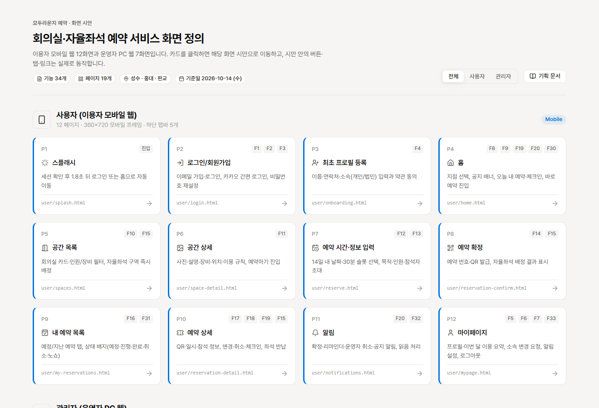
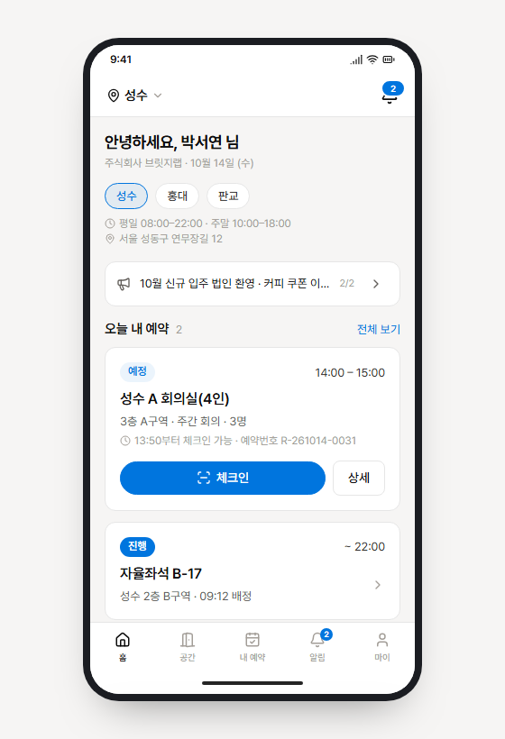
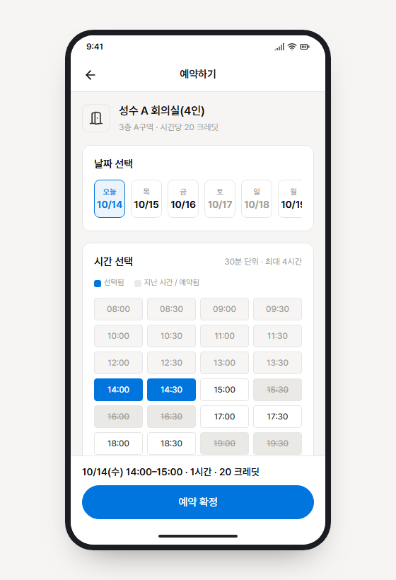
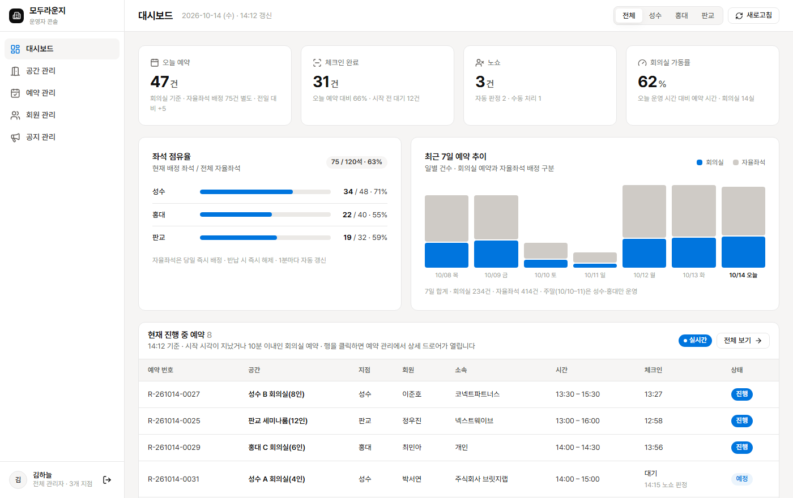
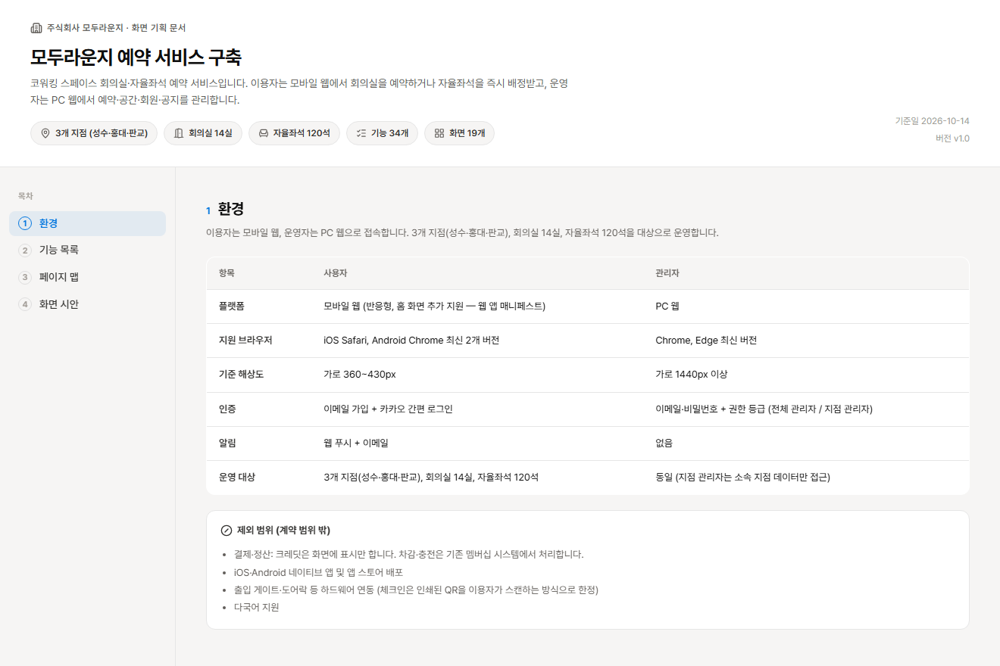

# 계약서 → HTML 화면 시안 파이프라인

SI 개발 계약서(기획서) PDF 한 장을 넣으면 **기능 정의 → 페이지 맵 → 동작하는 HTML 화면 시안 → 고객 공유용 기획 문서**까지 자동으로 뽑아내는 [Claude Code](https://claude.com/claude-code) 워크플로우 키트입니다.

기획자가 계약서를 받고 "이걸 화면으로 그려서 보여줘야 하는데" 하는 지점부터, 고객사에 링크로 보낼 수 있는 결과물까지를 한 번에 메웁니다.

```
contract/계약서.pdf  →  /build  →  01_FEAT.md · 02_PAGE.md · pages/**.html · docs/index.html
```

**▶ [라이브 데모](https://gnaak.github.io/prd/)** — 가상의 계약서로 뽑은 화면 시안 19장과 고객 문서를 직접 눌러볼 수 있습니다.



---

## 무엇이 나오나

이 repo에는 가상의 계약서(`contract/sample-contract.pdf` — 코워킹 스페이스 "모두라운지"의 회의실·좌석 예약 서비스)로 파이프라인을 완주한 **실제 산출물이 그대로 들어 있습니다.** 클론해서 바로 열어볼 수 있습니다.

| 단계 | 산출물 | 내용 |
|---|---|---|
| 1 | [`01_FEAT.md`](01_FEAT.md) | 기능 카탈로그 34개 (노션 DB로 바로 import 가능한 표 + 기능별 핵심 동작) |
| 2 | [`02_PAGE.md`](02_PAGE.md) | 페이지 맵 19화면 (표 + 사용자·관리자 트리) |
| 3 | [`pages/`](pages/) | HTML 목업 19장 — 버튼·탭·시트가 실제로 동작 |
| 마무리 | [`docs/index.html`](docs/index.html) | 고객사에 그대로 보낼 수 있는 인터랙티브 기획 문서 |

**로컬에서 보려면**: `pages/index.html`(시안 허브) 또는 `docs/index.html`(고객 문서)을 브라우저로 엽니다. 페이지 간 상대경로 링크가 동작하려면 폴더 구조를 유지한 채 열어야 합니다 (VS Code Live Server 권장 — 포트 5501로 설정되어 있습니다).

### 시안 톤

**사용자 — 모바일.** 다크 베젤 폰 프레임(376×736) 안에 360×720 스크린. 상태바·홈 인디케이터 고정, 스크롤은 본문에서만. 노치·카메라홀 같은 장식은 넣지 않습니다.

<p align="center">
  
  
</p>

**관리자 — PC.** 220px 좌측 GNB + 전체 폭 콘텐츠. KPI 카드, 헤어라인 테이블, 우측 드로어, 모달.



**고객 공유 문서.** 기능 목록·페이지 맵·화면 시안을 한 문서에 담고, 카드에서 실제 시안으로 이동합니다.



디자인은 [`DESIGN.md`](DESIGN.md)의 Notion 톤을 따릅니다 — warm paper 캔버스(`#f6f5f4`)에 흰 카드, 구조 액센트는 파랑(`#0075de`) 하나, 아이콘은 Lucide. **그라데이션 CTA·진한 드롭섀도·이모지 남발 같은 "AI가 만든 티"는 규칙으로 금지**되어 있고 linter가 잡습니다.

---

## 쓰는 법

### 1. 준비

Claude Code가 설치된 상태에서 이 repo를 클론합니다. 파이프라인 본체(에이전트 정의·`/build`·규칙 문서)는 플랫폼을 가리지 않고, **훅 3개만 PowerShell**입니다 — 자세한 건 아래 [플랫폼](#플랫폼)을 보세요.

```bash
git clone <this-repo>
cd prd
```

### 2. 계약서 넣고 실행

```
contract/ 에 기획서 PDF를 넣는다
  ↓
채팅에 /build
```

끝입니다. 스코프를 되묻지 않고 끝까지 진행하며, 해석이 갈리는 범위는 보수적으로 포함한 뒤 완료 보고에 명시합니다. PDF를 감지하면 `/build` 없이 "ㄱㄱ" / "시작" 같은 진행 신호만 줘도 같은 파이프라인이 돕니다.

기존 샘플 산출물은 새 계약서 기준으로 덮어써집니다. 이 repo를 키트로만 가져가려면 `CLAUDE.md` + `DESIGN.md` + `AGENT.md` + `.claude/` + `.gitignore` + 빈 `contract/`만 복사하세요.

### 3. 중간에 멈췄다면

`/build`를 다시 치지 말고 (처음부터 재실행됩니다) 그냥 "계속"이라고 하면 됩니다. 진행 상태가 대화 기억이 아니라 **디스크**에 있어서, 훅이 "어느 파일이 비었나"를 보고 남은 단계를 이어갑니다.

---

## 어떻게 동작하나

한 명의 에이전트가 전부 만들지 않습니다. **오케스트레이터가 단계별 전담 에이전트에 위임하고, 매 단계 별도 컨텍스트의 reviewer가 검토**합니다.

```
계약서 PDF
   │
   ├─ feat-writer (opus) ──── 01_FEAT.md ──── reviewer ──┐
   │                                                      │ 통과해야
   ├─ page-mapper (sonnet) ── 02_PAGE.md ──── reviewer ──┤ 다음 단계
   │                                                      │
   ├─ ui-foundation (opus) ── common.css + 허브 + 기준 페이지 2장
   │      └─ html-builder (sonnet) × N ── 페이지 1장씩 병렬 생성
   │            └─ linter (haiku) ── 기계 검사 ── reviewer ─┤
   │                                                      │
   └─ docs-builder (sonnet) ─ docs/index.html ────────────┘
```

**자가 합리화를 구조로 막습니다.** 오케스트레이터는 자기(또는 하위 에이전트)가 만든 산출물을 스스로 "통과" 처리할 수 없고, 하위 에이전트에게는 reviewer를 호출할 도구 자체가 없습니다. 검토를 건너뛰면 진행 마커가 만들어지지 않고, 마커가 없으면 훅이 턴 종료를 막습니다.

**완료 판정은 파일 개수가 아니라 내용으로 합니다.** 예전에 빈 `<html></html>` 스텁 5장이 "개수"만 채워 완료로 종료된 사고가 있었습니다. 지금은 `02_PAGE.md`의 `파일` 컬럼을 단일 기준으로 삼아, 모든 기대 파일이 존재하고 비어 있지 않고 `common.css`를 import하는지 게이트가 직접 확인합니다. 표에 없는 고아 파일도 잡습니다.

| 구성 요소 | 파일 | 모델 |
|---|---|---|
| 1단계 생성 (계약 해석) | `.claude/agents/feat-writer.md` | opus |
| 2단계 생성 (페이지 맵) | `.claude/agents/page-mapper.md` | sonnet |
| 3단계 기반 (CSS·허브·기준 페이지) | `.claude/agents/ui-foundation.md` | opus |
| 3단계 양산 (페이지 1장/호출) | `.claude/agents/html-builder.md` | sonnet |
| 기계적 검사 | `.claude/agents/linter.md` | haiku |
| 단계 검토 게이트 | `.claude/agents/reviewer.md` | opus |
| 고객 문서 | `.claude/agents/docs-builder.md` | sonnet |
| 훅 (감지·단계 트리거·완주 게이트) | `.claude/hooks/*.ps1` | — |
| 진입점 | `.claude/commands/build.md` | — |

추론이 무거운 곳(계약 해석, 디자인 기반, 검토)에 opus, 양산에 sonnet, grep 검사에 haiku를 배치했습니다.

---

## 문서

| 파일 | 역할 |
|---|---|
| [`CLAUDE.md`](CLAUDE.md) | 각 단계 산출물의 형식·디자인 규칙 — **가장 권위 있는 문서** |
| [`DESIGN.md`](DESIGN.md) | 디자인 토큰 (색·타이포·라운드·그림자·모바일 프레임 스펙) |
| [`AGENT.md`](AGENT.md) | 오케스트레이터 실행 룰 + 마커 프로토콜 |
| `설명서.txt` | 사용법·점검 치트시트 (한국어) |
| `동작방식.txt` | 훅 판정 트리와 전체 흐름도 (한국어) |

디자인 톤을 바꾸려면 `DESIGN.md`를 갈아끼우고 `CLAUDE.md`의 3단계 섹션을 맞추면 됩니다. 나머지 파이프라인은 그대로 돕니다.

---

## 플랫폼

파이프라인 본체 — 에이전트 정의, `/build`, `CLAUDE.md`·`DESIGN.md`·`AGENT.md` 규칙 — 는 전부 마크다운이라 어디서든 동작합니다. OS를 타는 건 **훅 3개뿐**입니다.

| | Windows | macOS · Linux |
|---|---|---|
| 파이프라인 (1~3단계 + docs) | ✅ | ✅ |
| 훅 (자동 연결 · 완주 게이트) | ✅ | PowerShell 필요 |

`.claude/settings.json`이 훅을 `powershell`로 호출하는데, macOS·Linux에서는 PowerShell Core가 `pwsh`로 설치됩니다. 그래서 그대로 두면 훅이 뜨지 않고 Claude Code가 조용히 넘어갑니다 — **파이프라인 자체는 계속 돕니다.** 오케스트레이터가 `AGENT.md` 절차를 직접 따르기 때문이고, 다만 이런 걸 잃습니다:

- 턴이 끝날 때 다음 단계를 강제 주입하는 **자동 연결** (대신 "계속"이라고 한 번씩 말해주면 됩니다)
- 빈 스텁·고아 파일을 막는 **완주 게이트** (reviewer 검토는 그대로 동작합니다)

훅까지 쓰려면 [PowerShell Core](https://github.com/PowerShell/PowerShell)를 설치하고 `.claude/settings.json`의 `powershell`을 `pwsh`로 바꾸면 됩니다. 훅 스크립트는 win32 전제(경로 구분자·`ascii` 인코딩)로 쓰여 있어 약간의 손질이 필요할 수 있습니다.

---

## 시안을 링크로 공유하기

산출물이 전부 정적 HTML이라 GitHub Pages로 그대로 띄울 수 있습니다. 저장소 **Settings → Pages → Source: Deploy from a branch → `main` / `(root)`** 로 설정하면 끝입니다.

| 경로 | 내용 |
|---|---|
| `/` | 랜딩 (`index.html`) — 시안 허브와 고객 문서로 가는 입구 |
| `/pages/index.html` | 화면 시안 허브 19장 |
| `/docs/index.html` | 고객 공유 기획 문서 |

루트의 `.nojekyll`이 Jekyll 처리를 끄기 때문에 폴더 구조와 상대경로가 그대로 유지됩니다. 고객사에 보낼 때는 `/docs/index.html` 링크 하나면 충분합니다 — 문서 안의 시안 카드가 각 화면으로 연결됩니다.

---

## 한계

- **한 번에 한 기획서** — 산출물이 repo 루트에 flat하게 쌓입니다. 여러 고객사를 동시에 다루지 않습니다.
- **계약서의 금액·법적 조항·기간은 읽지 않습니다** — 오직 "무엇을 개발해야 하는가"만 봅니다.
- 시안은 **정적 HTML 목업**입니다. 더미 데이터는 실제 길이·개수와 비슷하게 채우지만 백엔드는 없습니다.

## 라이선스

MIT
